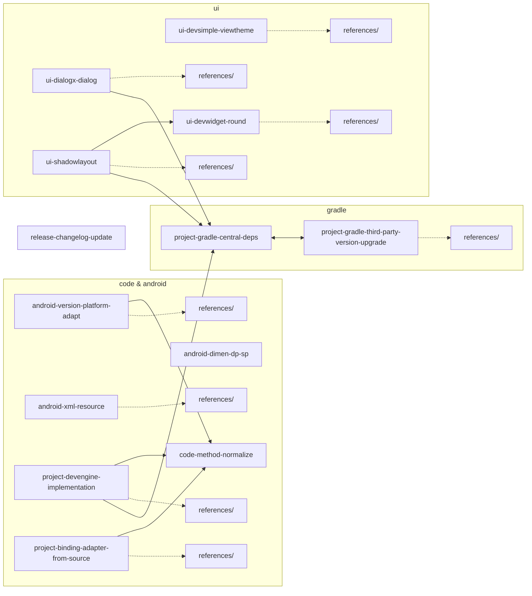

# Cursor Skills 本地路径与仓库关联审计

本文档重新扫描 **`.cursor/skills/`** 下全部当前 Skill 文件，归纳其中的 **本地/仓库相对路径**、**目录契约**、**跨 Skill 链接**、**references 分工** 与 **仍可能漂移的快照数据**。

**扫描范围**：`.cursor/skills/`  
**当前有效目录**：13 个 Skill 目录，9 个含 `references/`（每个 `references/` 下当前为单文件 `reference.md`）。  
**捆绑资源现状**：暂无 `scripts/` 或 `assets/`；唯一在用的捆绑目录是 `references/`。  
**忽略项**：`.DS_Store` 等本地杂项。  
**未发现**：绝对机器路径（如用户主目录或本机项目根路径）写入 Skill 正文。

---

## 1. 引用类型说明

| 类型 | 含义 | 现状判断 | 典型风险 |
|------|------|----------|----------|
| **A. 契约化仓库布局** | 用 `DEPS_ROOT`、`DEVSIMPLE_ROOT` 等符号承载仓库目录 | 推荐，当前多处已采用 | fork 或目录迁移时只需改契约表 |
| **B. 明确约定文件名** | `CHANGELOG.md`、`build.gradle`、`versions.gradle` 等按任务上下文定位的文件 | 可接受 | 多模块时需明确库根或版本源 |
| **C. 模块内相对锚点** | `*.kt`、`attribute/`、`ViewTheme.*` 等文件/样式名 | 适合放在 `references/` | 新增或重命名文件后表格漂移 |
| **D. Skill 互链** | `../other-skill/SKILL.md`、`../other-skill/references/<file>.md` | 当前合理 | 重命名 Skill 时断链；由 `project-cursor-catalog-sync` 维护 |
| **E. 上游 raw URL** | GitHub raw 中的上游内部路径，如 `shadowLibrary/...` | 可接受，非工作区路径 | 需与 Maven/JitPack 版本 tag 对齐 |
| **F. 历史类名示例** | `JobSchedulerUtils`、`TextView.kt` 等 | 应仅作为 `references/` 示例 | 类迁移后不应阻塞执行 |

---

## 2. 按 Skill 汇总

图例：**中** = 有仓库契约或 `references/` 全表需要维护；**轻** = 主要是约定文件名、外链或少量锚点；**无** = 基本不绑路径。当前无 **重** 级待改项。

| Skill `name` | 关联强度 | 本地/仓库路径与关联摘要 | `references/` |
|--------------|:--------:|-------------------------|:-------------:|
| `android-dimen-dp-sp` | **轻** | 仅 Android 惯例 `values/dimens.xml`；明确不搜索仓库校验 dimen | — |
| `android-version-platform-adapt` | **轻** | `DEVAPP_ROOT=lib/DevApp`；官方版本文档 URL 为主要事实源；历史类名仅在 `references/` 作扫描示例 | 是 |
| `android-xml-resource` | **轻** | 自包含的资源命名规范；无仓库路径锚点，命名全表/示例/反例在 `references/` | 是 |
| `code-method-normalize` | **无** | 规则型方法风格 Skill，正文无仓库路径；被多个 Skill 作为成稿规范引用 | — |
| `project-binding-adapter-from-source` | **中** | `DEVSIMPLE_ROOT`、`BINDING_VIEW_DIR`、`BINDING_ATTR_DIR`；范例文件名迁入 `references/` | 是 |
| `project-devengine-implementation` | **中** | `DEVASSIST_ENGINE_ROOT`、`DEVENGINE_ROOT`、`DEVENGINE_CORE_ROOT`、`DEVENGINE_EXT_ROOT`、`DEVENGINE_README`、`DEPS_ROOT`；路径清单与同步点在 `references/` | 是 |
| `project-gradle-central-deps` | **中** | `DEPS_ROOT=file/gradle`、`DEPS_MANIFEST=file/deps`；契约化良好 | — |
| `project-gradle-third-party-version-upgrade` | **中** | 已对齐 `DEPS_ROOT` / `DEPS_MANIFEST`；`references/` 保留版本查询 API 与注释风格示例 | 是 |
| `release-changelog-update` | **轻** | `CHANGELOG.md`、库根 git `PATH`；不写死具体 `lib/**` | — |
| `ui-devsimple-viewtheme` | **中** | `DEVSIMPLE_ROOT`、`DEVSIMPLE_VALUES`；根样式全表与继承链在 `references/` | 是 |
| `ui-devwidget-round` | **轻** | `DEVWIDGET_ROOT=lib/DevWidget`；Round 类型清单、属性表与 API 在 `references/` | 是 |
| `ui-dialogx-dialog` | **轻** | 依赖坐标走 `DEPS_ROOT` 集中声明（DialogX 为第三方）；组件工厂/setter/全局配置/枚举/主题包全表在 `references/` | 是 |
| `ui-shadowlayout` | **轻** | 无工作区路径，使用 Maven + 上游 raw；`hl_*` 属性全表与 API 在 `references/` | 是 |

---

## 3. 重点审计结果

### 3.1 已契约化且状态较好

| Skill | 契约 | 说明 |
|-------|------|------|
| `project-gradle-central-deps` | `DEPS_ROOT`、`DEPS_MANIFEST` | 新增依赖路径唯一来源，结构清晰 |
| `project-gradle-third-party-version-upgrade` | `DEPS_ROOT`、`DEPS_MANIFEST` | 已与 `project-gradle-central-deps` 对齐 |
| `project-binding-adapter-from-source` | `DEVSIMPLE_ROOT`、`BINDING_VIEW_DIR`、`BINDING_ATTR_DIR` | 硬编码多文件列表已移至 `references/` |
| `project-devengine-implementation` | `DEVENGINE_*` / `DEVASSIST_ENGINE_ROOT` / `DEPS_ROOT` | 多锚点路径表集中在正文「路径锚点」，目录契约清晰 |
| `ui-devsimple-viewtheme` | `DEVSIMPLE_ROOT`、`DEVSIMPLE_VALUES` | 样式全表已移至 `references/` |
| `ui-devwidget-round` | `DEVWIDGET_ROOT` | 已本地优先，属性与 API 表已拆 `references/` |
| `android-version-platform-adapt` | `DEVAPP_ROOT` | 类名锚点弱化为扫描示例 |

### 3.2 长表与快照数据已拆分（在 `references/` 内）

| Skill | 发现 | 建议 |
|-------|------|------|
| `android-xml-resource` | 资源命名前缀全表、值编码族语法、示例与反例 | 命名规则变化时只更新 `references/` |
| `project-binding-adapter-from-source` | 范例文件名、前缀表 | 新增绑定适配器范例时只更新 `references/` |
| `project-devengine-implementation` | 路径清单、命名契约、同步点 | Engine 目录结构变化时更新 `references/` |
| `project-gradle-third-party-version-upgrade` | 版本查询 API 源与示例 | 查询源变化时更新 `references/` |
| `ui-devsimple-viewtheme` | `ViewTheme.*` 根样式表 | DevSimple 新增样式后按 `references/` 的 grep 步骤更新 |
| `ui-devwidget-round` | `DevWidget` 属性表、Round 类型清单 | DevWidget 新增属性/类时更新 `references/` |
| `ui-dialogx-dialog` | 组件工厂、链式 setter、全局配置、枚举、主题包全表 | DialogX 升级或 API 变更时更新 `references/` |
| `ui-shadowlayout` | `hl_*` 属性全表、上游 raw/API 表 | ShadowLayout 升级或属性变更时更新 `references/` |

### 3.3 仅保留为 `references/` 示例的类名或文件名

| Skill | 示例锚点 | 当前处理 |
|-------|----------|----------|
| `android-version-platform-adapt` | `JobSchedulerUtils`、`ProcessUtils`、`ScreenUtils` 等 | 已放在 `references/` 的扫描示例；SKILL 正文只要求按 `{DEVAPP_ROOT}` 检索 |
| `project-binding-adapter-from-source` | `TextView.kt`、`ImageViewLoadNative.kt`、`XYI.kt` 等 | 作为 `references/` 范例文件名；SKILL 正文使用 `{BINDING_VIEW_DIR}` / `{BINDING_ATTR_DIR}` |
| `ui-devsimple-viewtheme` | `ViewTheme.*` 全表 | 已放在 `references/`，并提供 grep 更新步骤 |

---

## 4. 跨 Skill 与 references 链接图

实线 = Skill 间依赖（`../<skill>/SKILL.md`）；虚线 = 指向自身 `references/`。`android-dimen-dp-sp`、`code-method-normalize`、`release-changelog-update`、`project-gradle-central-deps` 无 `references/`。

```mermaid
flowchart LR
  subgraph gradle[gradle]
    GCD[project-gradle-central-deps]
    GTP[project-gradle-third-party-version-upgrade]
    GCD <--> GTP
    GTP -.-> GTPR[references/]
  end

  subgraph codeandroid[code & android]
    CMN[code-method-normalize]
    ADS[android-dimen-dp-sp]
    AVPA[android-version-platform-adapt]
    AXR[android-xml-resource]
    DEI[project-devengine-implementation]
    BAS[project-binding-adapter-from-source]
    AVPA --> CMN
    BAS --> CMN
    DEI --> CMN
    AVPA -.-> AVPAR[references/]
    AXR -.-> AXRR[references/]
    DEI -.-> DEIR[references/]
    BAS -.-> BASR[references/]
  end

  subgraph ui[ui]
    UDV[ui-devsimple-viewtheme]
    UDR[ui-devwidget-round]
    UDX[ui-dialogx-dialog]
    USL[ui-shadowlayout]
    USL --> UDR
    UDV -.-> UDVR[references/]
    UDR -.-> UDRR[references/]
    UDX -.-> UDXR[references/]
    USL -.-> USLR[references/]
  end

  RCU[release-changelog-update]

  DEI --> GCD
  UDX --> GCD
  USL --> GCD
```

---

## 5. 待改进建议

项目专属 Skill 已按 `project-skill-conventions` 统一加 `project-` 前缀（如 `project-gradle-central-deps`、`project-gradle-third-party-version-upgrade`、`project-binding-adapter-from-source`、`project-devengine-implementation`）；可复用 Skill（`android-*`、`code-*`、`release-*`，以及封装第三方库的 `ui-dialogx-dialog`/`ui-shadowlayout`）维持原前缀。参考资料已统一为复数 `references/` 目录。

后续只需按变更场景维护：

| 场景 | 维护动作 |
|------|----------|
| 新增 / 删除 / 重命名 Skill 或 `references/` | 按 `.cursor/rules/project-cursor-catalog-sync.mdc` 同步 `.cursor/README.md`、`.cursor/directory-tree.md` 与互链 |
| SKILL 内出现新的长表、扫描清单、属性全表 | 按 `.cursor/rules/authoring-agent-skills.mdc` 拆入 `references/` |
| 新建或重命名 Skill 需定前缀 | 按 `.cursor/rules/project-skill-conventions.mdc` 选用本项目领域前缀 / `project-` |
| DevSimple / DevWidget / ShadowLayout / DialogX 上游属性或源码变化 | 更新对应 `references/`，SKILL 仅保留流程和关键坑 |
| Gradle 依赖布局改变 | 更新两个 `project-gradle-*` Skill 的 `DEPS_ROOT` / `DEPS_MANIFEST` 契约 |
| DevApp 平台工具类重构 | 更新 `android-version-platform-adapt/references/` 的扫描示例，不在 SKILL 正文硬编码类名 |

---

## 6. 建议落地顺序

暂无待落地改造。后续按 §5 的变更场景维护即可。

---

## 7. 相关规则与文档

| 文档 | 说明 |
|------|------|
| [../rules/project-cursor-catalog-sync.mdc](../rules/project-cursor-catalog-sync.mdc) | README / directory-tree 同步、Skill 互链维护 |
| [../rules/authoring-agent-skills.mdc](../rules/authoring-agent-skills.mdc) | 通用命名族与 `SKILL.md` / `references/` 分工、目录结构 |
| [../rules/project-skill-conventions.mdc](../rules/project-skill-conventions.mdc) | DevUtils 领域前缀体系、消歧与路径锚点 |
| [../README.md](../README.md) | 当前 `.cursor` 编目总表 |
| [../directory-tree.md](../directory-tree.md) | `.cursor/` 完整目录树 |

---

*审计依据：重新扫描 `.cursor/skills/**/*.md` 中的契约符号、`lib/`、`file/`、`src/main/`、`references/`、`../*/SKILL.md`、`ViewTheme.*`、`attrs.xml`、历史类名等模式，并结合当前目录实际子项人工归类。*
